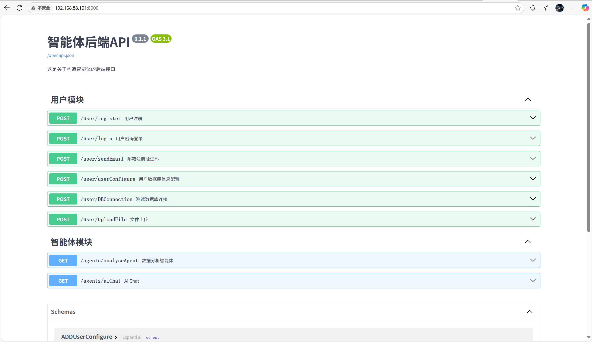

# 小耶智能体(API)

        

[TOC]

## 一、项目前言

该项目是基于LangChain和LangGraph来构建多功能智能体，然后通过接口FastApi的方式进行与前端交互，该项目的最终目的是打造各种智能体，帮助人们完成的特定的需求任务，能更加充分的利用AI的能力。目前有多模态的AI接口和数据分析分析智能体，其它智能体正在加速构建中，如果你对我们的项目感兴趣，可以通过[huangxiaoye6@qq.com](http://mail.qq.com/cgi-bin/qm_share?t=qm_mailme&email=Jk5TR0hBXk9HSV9DEGZXVwhFSUs)邮箱来加入我们，<a target="_blank" href="http://mail.qq.com/cgi-bin/qm_share?t=qm_mailme&email=Jk5TR0hBXk9HSV9DEGZXVwhFSUs" style="text-decoration:none;"></a>，期待你构建属于你自己的智能体。

#### 1、目录结构

```
agent/
├─ .dockerignore               # Docker 忽略文件配置
├─ compose.yaml                # Docker Compose 配置文件（定义多容器服务的编排）
├─ Dockerfile                  # Docker 镜像构建配置文件
├─ main.py                     # 应用程序入口文件
├─ poetry.lock                 # Poetry 依赖锁文件
├─ pyproject.toml              # Poetry 项目配置文件
├─ README.md                   # 项目说明文档
├─ requirements.txt            # Python 依赖文件（备用依赖列表，通常用于非 Poetry 环境）
├─ settings.py                 # 项目配置文件（存储全局配置项）
├─ utils/                      # 工具函数目录
│  ├─ auth.py                  # 认证相关工具函数
│  ├─ redis.py                 # Redis 操作相关工具函数
│  └─ send_email.py            # 发送邮件相关工具函数
├─ schemas/                    # 数据模式定义目录
│  ├─ AgentSchema.py           
│  └─ UserSchema.py            
├─ models/                     # 数据模型目录
│  └─ UserModel.py             
├─ media/                      # 媒体文件目录（存储上传的文件或生成的媒体内容）
│  ├─ uploadFile               # 用户上传文件存储目录
│  └─ ai_charts                # AI 生成的图表存储目录
├─ dependencies/               # 依赖注入目录
│  └─ UserDepends.py           
├─ celery_task/                # Celery 任务目录（定义异步任务）
│  ├─ celery.py                # Celery 配置文件
│  └─ task.py                  # Celery 任务定义文件
├─ apps/                       # api接口目录
│  ├─ agents.py                
│  ├─ ai.py                    
│  └─ user.py                  
└─ agents/                     # Agent 功能模块目录（实现具体 Agent 的逻辑）
   ├─ ai_chat.py               # AI 聊天相关功能
   ├─ analysisAgent.py         # 数据分析 Agent 相关功能
   └─ tools.py                 # 通用工具函数（供 Agent 使用）
```

## 二、项目部署

项目部署分为docker部署和本地部署，大家可根据自己的需求进行选择，这是项目的[部署说明](./docs/deploy.md)

## 三、项目成功启动

输入你服务器的IP地址和端口：8000就可以访问项目了，如127.0.0.1:8000，如下图

​    


## 致大家🙋‍♀️🙋‍♂️

特别感谢[LangChain](https://python.langchain.com/docs/tutorials/)，[LangGraph](https://langchain-ai.github.io/langgraph/)，[FastAPI](https://fastapi.tiangolo.com/)等开源项目。

如果本项目帮助到了你，请给项目加个[Star](https://github.com/huangxiaoye6/django-rest-framework-DRF--house-/blob/main)，让更多的人看到。 您的回复和支持将会是我继续更新维护下去的动力。

当然无论是大模型的接口还是部署开源大模型，都需要很高的维护成本，作为一个学生还是很难承担，如果你愿意支持作者，可以扫码对该项目做出贡献

<left class="half">
    
    
</left>