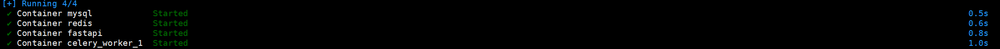
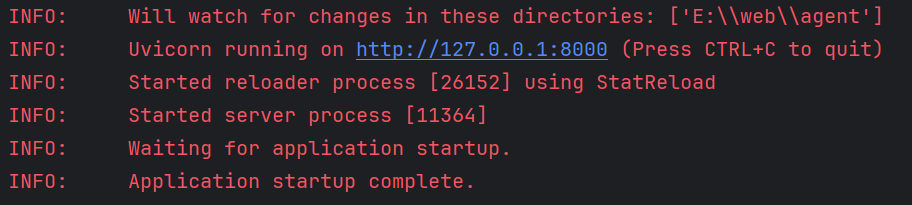

## 小耶智能体的项目部署

[TOC]


#### 密钥工具官网如下

[E2B官网](https://e2b.dev/)

[Tavily官网](https://tavily.com/)

[阿里大模型广场](https://bailian.console.aliyun.com/#/home)

[网易邮箱](https://mail.163.com/)

[LangSmith官网](https://smith.langchain.com/)

### 一、docker部署（推荐）

##### （1）项目下载

```sh
git clone https://github.com/huangxiaoye6/xiaoye-agent.git  # 克隆项目
```

##### （2）目录准备

```sh
rm xiaoye-agent agent # 文件重命名

cd agent # 进入目录

apt install docker #安装docker
```

##### （3）镜像构建

```sh
# 下载镜像
docker pull nginx:latest
docker pull mysql:8.0
docker pull redis:6.0-alpine
```

下载**agent_app:v1.0**镜像

```
docker pull huangxiaoye6/agent_api:v1.0
```

如果你下载了**agent_app:v1.0**的镜像就可以跳过制作执行的步骤

```sh
#制作镜像
docker build -t agent_api:v1.0 .
```

##### （4）compose.yaml文件

```sh
name: agent
services:
  mysql:
    container_name: mysql
    image: mysql:8.0
    restart: always
    networks:
      - agent_network
    ports:
      - "3305:3306"
    environment:
      - MYSQL_ROOT_PASSWORD=123456
      - MYSQL_DATABASE=agent
    volumes:
      - mysql_data:/var/lib/mysql
      - ./mysql/conf:/etc/mysql/conf.d

  redis:
    container_name: redis
    image: redis:6.0-alpine
    restart: always
    networks:
      - agent_network
    ports:
      - "6379:6379"
    volumes:
      - redis_data:/data               
      - /etc/localtime:/etc/localtime:ro
    logging:
      driver: "json-file"
      options:
        max-size: "20m"
        max-file: "3"

  fastapi:
    container_name: fastapi
    image: agent_api:v1.0
    restart: always
    networks:
      - agent_network
    ports:
      - "8000:8000"
    environment:
      - http_proxy=http://host.docker.internal:7890
      - LANGCHAIN_TRACING_V2=true
      - LANGCHAIN_API_KEY=              # LangSmith的APIKey填写
      - E2B_API_KEY=                    # E2B的APIKey填写
      - TAVILY_API_KEY=                 # TAVILY工具APIKey填写
      - OPENAI_API_KEY=                 # OpenAPI的APIKey填写，可以是其它大模型，如qwen，deepseek的APIKey，这里我推荐阿里的qwen模型，对中文好用，也支持function calling
      - DB_HOST=mysql
      - DB_PORT=3306
      - DB_USER=root
      - DB_PASSWORD=123456
      - DB_NAME=agent
      - EMAIL_HOST_USER=                # 邮箱账号填写
      - EMAIL_FROM=                     # 邮箱账号填写
      - EMAIL_HOST_PASSWORD=            # 邮箱密钥填写
      - REDIS_CACHE_URL=redis://redis:6379/0
      - CELERY_BACKEND=redis://redis:6379/1
      - CELERY_BROKER=redis://redis:6379/2
    depends_on:
      - mysql
    command: >
      sh -c "
        cd /agent &&
        sleep 5 &&
        aerich init -t settings.orm &&
        aerich init-db &&
        aerich migrate &&
        aerich upgrade &&
        uvicorn main:app --host 0.0.0.0 --port 8000
      "
  celery_worker_1:
    container_name: celery_worker_1
    image: agent_api:v1.0
    restart: always
    networks:
      - agent_network
    environment:
      - http_proxy=http://host.docker.internal:7890
      - LANGCHAIN_TRACING_V2=true
      - LANGCHAIN_API_KEY=              # LangSmith的APIKey填写
      - E2B_API_KEY=                    # E2B的APIKey填写
      - TAVILY_API_KEY=                 # TAVILY工具APIKey填写
      - OPENAI_API_KEY=                 # OpenAPI的APIKey填写，可以是其它大模型，如qwen，deepseek的APIKey
      - DB_HOST=mysql
      - DB_PORT=3306
      - DB_USER=root
      - DB_PASSWORD=123456
      - DB_NAME=agent
      - EMAIL_HOST_USER=                # 邮箱账号填写
      - EMAIL_FROM=                     # 邮箱账号填写
      - EMAIL_HOST_PASSWORD=            # 邮箱密钥填写
      - REDIS_CACHE_URL=redis://redis:6379/0
      - CELERY_BACKEND=redis://redis:6379/1
      - CELERY_BROKER=redis://redis:6379/2
    command: >
      sh -c "
        cd /agent &&
        sleep 15 &&
        celery -A celery_task worker -l info  -n worker1.%h -P eventlet --concurrency=20 --max-tasks-per-child=20
      "
    logging:
      driver: "json-file"
      options:
        max-size: "20m"
        max-file: "3"
    depends_on:
      - redis
      - fastapi

volumes:
  mysql_data:
  redis_data:

networks:
  agent_network:
```


##### （5）容器编排启动

```sh
docker compose up -d
```

容器启动成功界面




### 二、本地部署

##### （1）下载项目

```sh
git clone https://github.com/huangxiaoye6/xiaoye-agent.git  # 克隆项目
```

##### （2）创建环境变量文件.env

在项目的根目录下创建.env文件

##### （3）编辑.env文件

```sh
http_proxy=127.0.0.1:7890

LANGCHAIN_TRACING_V2=true

LANGCHAIN_API_KEY=          # LangSmith的APIKey填写

E2B_API_KEY=                # E2B的APIKey填写

TAVILY_API_KEY=             # TAVILY工具APIKey填写

OPENAI_API_KEY=             # OpenAPI的APIKey填写，可以是其它大模型，如qwen，deepseek的APIKey,这里我推荐阿里的qwen模型，对中文好用，也支持function calling

# Mysql数据库配置
DB_HOST=127.0.0.1
DB_PORT=3306
DB_USER=root
DB_PASSWORD=123456
DB_NAME=agent

# redis配置
REDIS_CACHE_URL=redis://127.0.0.1:6379/0

# 邮箱配置
EMAIL_HOST_USER =                      # 邮箱账号填写
EMAIL_FROM =                           # 邮箱账号填写
EMAIL_HOST_PASSWORD =                  # 邮箱密钥填写

# celery配置
CELERY_BACKEND=redis://127.0.0.1:6379/1
CELERY_BROKER=redis://127.0.0.1:6379/2
```

##### （4）MySQL和Redis配置

MySQL配置

```mysql
mysql -uroot -p # 输入密码
create database agent;
```

Redis配置

```sh
redsi-server # 在终端运行命令
```

##### （5）数据库迁移

进入xiaoye-agent目录下执行以下命令

```sh
aerich init -t settings.py.orm # 数据库配置连接
aerich init-db  # 初始化数据库
aerich migrate  # 迁移模型文件
aerich upgrade  # 更新数据库
```

##### （6）启动

运行main.py文件就可以了,如下图就运行成功



[返回文档说明](../README.md)